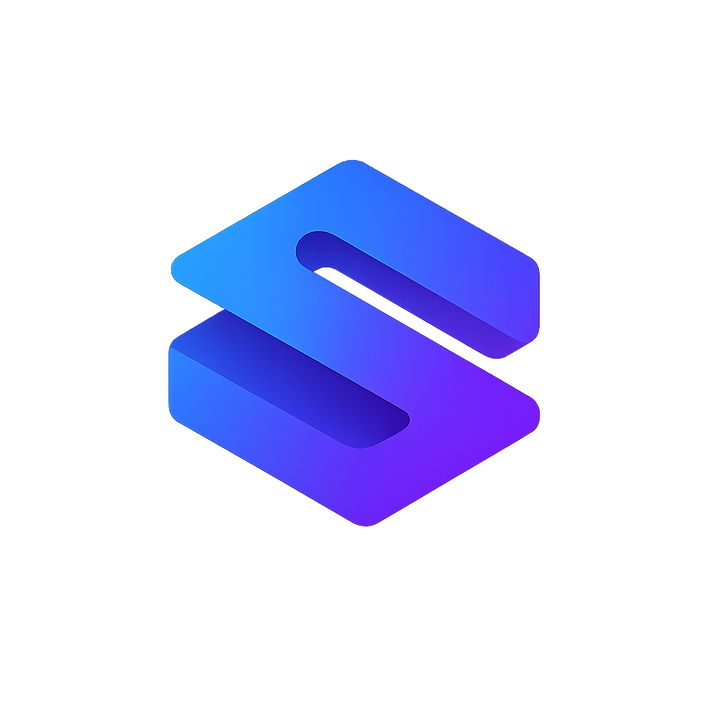

<p align="center">
  
</p>

<h1 align="center">Selynt Panel</h1>

<p align="center">
  Plugin para <a href="https://www.directadmin.com/">DirectAdmin</a> que gerencia aplicações <strong>Node.js</strong> e <strong>Rust</strong> com proxy via Unix socket pelo <strong>OpenLiteSpeed</strong>.
</p>

<p align="center">
  <a href="https://github.com/NullSablex/selynt-panel/actions/workflows/ci.yml"></a>
  <a href="https://github.com/NullSablex/selynt-panel/releases/latest"></a>
  <a href="LICENSE"></a>
  
  
  
</p>

---

## Funcionalidades

**Administrador:**
- Visão geral de todas as aplicações do servidor
- Configuração do OpenLiteSpeed e detecção de versões Node.js

**Usuário:**
- Criar, iniciar, parar, reiniciar e remover aplicações
- Vincular aplicações a domínios e subdomínios
- Logs em tempo real (stdout/stderr)
- Alterar a versão do Node.js por aplicação

## Requisitos

| Componente | Versão mínima |
|---|---|
| DirectAdmin | — |
| OpenLiteSpeed | — |
| PHP CLI | 8.0+ |
| Node.js | **20.6+** |
| [core_selynt](https://github.com/NullSablex/core_selynt) | — |

> [!WARNING]
> **Node.js < 20.6 não é suportado.** O plugin usa a flag `--import` para injetar um loader ESM que força o uso de Unix sockets e bloqueia bind TCP/UDP.

## Instalação

No DirectAdmin, acesse **Plugin Manager** e instale usando a URL:

```
https://nullsablex.com/download/selynt_panel
```

## Estrutura

```
selynt_panel/
├── admin/           Painel administrativo (páginas + API)
├── user/            Painel do usuário (páginas + API)
├── lib/
│   ├── common.php   Utilitários PHP
│   └── node-loader.js   Loader ESM (Unix socket)
├── assets-src/      Código-fonte CSS/JS
├── hooks/           Hooks do DirectAdmin
├── scripts/         Instalação e configuração
├── bin/             Binário core_selynt
├── templates/       Templates para novas aplicações
└── images/          Menus e assets compilados
```

## Desenvolvimento

```bash
npm install
npm run build
```

Minifica os arquivos de `assets-src/` via [esbuild](https://esbuild.github.io/) e salva em `images/assets/`.

### CI/CD

- **CI** — build, validação do `plugin.conf`, sincronia do `version`, sintaxe PHP e shell
- **Release** — gera o pacote `.tar.gz` ao publicar uma release no GitHub

## Segurança

- Aplicações rodam sob o UID/GID do usuário (isolamento de privilégios)
- Loader Node.js bloqueia bind TCP/UDP, forçando Unix sockets
- Permissões de socket reconfiguradas após regeneração de vhosts

## Autor

**NullSablex** — [github.com/NullSablex](https://github.com/NullSablex)

## Licença

[AGPL-3.0-or-later](LICENSE)
